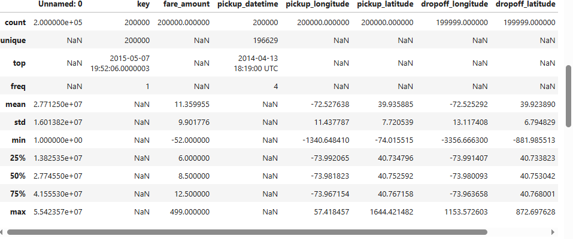
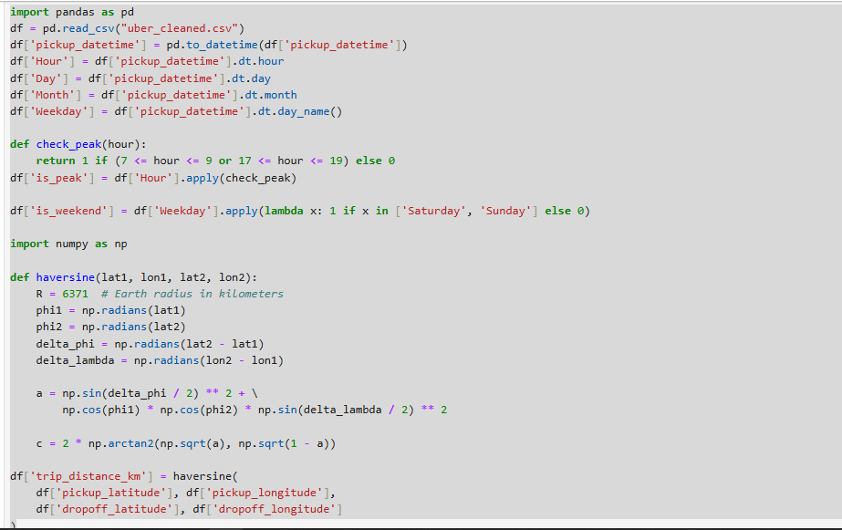
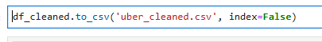
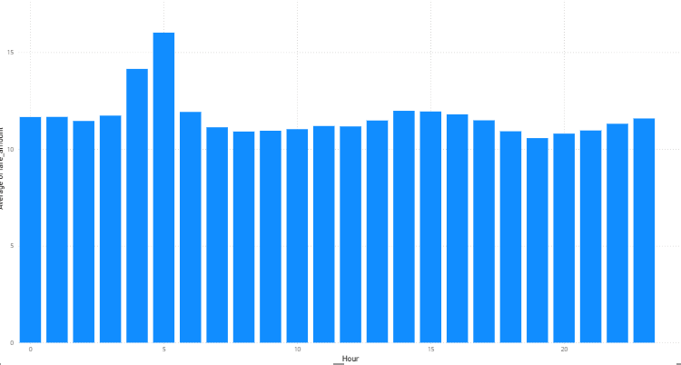
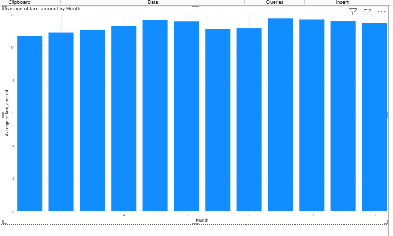
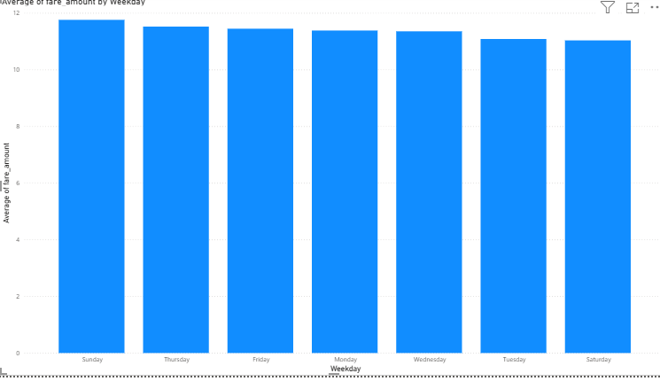
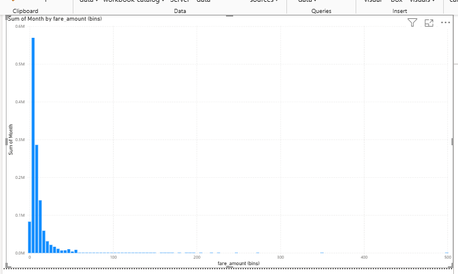

# Uber Fares Data Analysis Project

## 📊 Overview
This project explores and analyzes Uber fare data to uncover trends, patterns, and insights using Python for data preparation and Power BI for visualization.

## 🎯 Objectives
- Analyze Uber fare data for insights related to time, location, and fare value
- Visualize key trends using an interactive Power BI dashboard
- Support operational decisions through data-driven recommendations

## 🧰 Tools & Technologies
- **Python**: Data Cleaning & Feature Engineering (Pandas, Matplotlib, Seaborn)
- **Power BI**: Interactive Dashboard Creation
- **Dataset Source**: [Uber Fares Dataset - Kaggle](https://www.kaggle.com)

## 📁 Dataset Description
The dataset includes the following key variables:
- `Date/Time`
- `Fare Amount`
- `Distance`
- `Pickup Location`
- and more...

## 🧹 Data Cleaning Steps
- Checked for missing values
- Dropped or imputed null entries
- Converted data types (e.g., datetime format)
- Removed outliers to improve data quality
- 

## 📈 Descriptive Analysis
- Central tendency: Mean, Median, Mode
- Spread: Standard Deviation, Min, Max, Quartiles
- 

## 🔍 Key Insights
- **Fare vs Distance**: Positive correlation observed
- **Fare vs Time of Day**: Peak hours drive higher fare volumes
- **Outliers**: Fares above $50 are rare but significant
- **Distribution**: Right-skewed distribution; most fares between $5 and $15

## 🛠️ Feature Engineering
- Extracted new time-based features: `Hour`, `Day`, `Month`, `Weekday`
- Categorized times into `Peak` and `Off-Peak`
- Encoded categorical variables for improved analysis
- 

## 💾 Final Dataset
- Output file: `uber_cleaned_features.csv`
- Contains cleaned and feature-engineered data
- Used for Power BI import and visualization
- 

## 📊 Power BI Dashboard

### Dashboard Overview  

### Fare Distribution Chart  

### Time-Based Fare Analysis  

## ✅ Recommendations
- Adjust driver availability to align with peak hours
- Focus efforts in high-fare zones, especially during off-peak times
- Integrate external data (e.g., weather, traffic) for richer analysis

## 🧠 Conclusion
Uber fare trends are significantly influenced by time and location. Most trips are short, while longer rides, though rare, heavily influence fare distribution. The interactive dashboard empowers users to explore operational strategies efficiently.

---

👤 **Author**: NGOGA Desire Arnaud  
📘 **Course**: Introduction to Big Data  
🆔 **Student ID**: 27627
